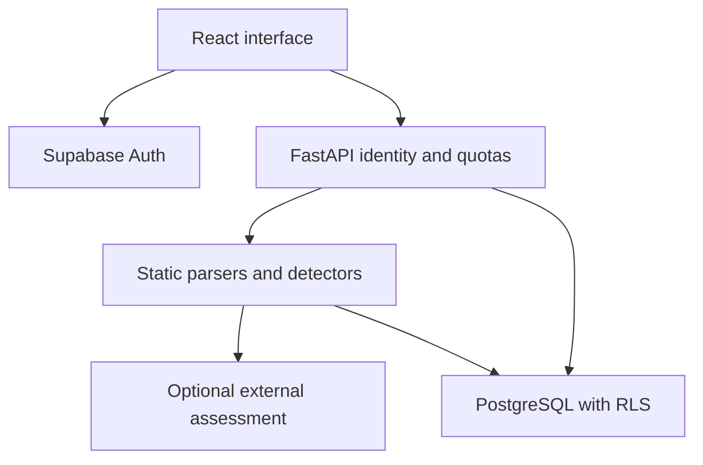

# Cybersecurity Evidence Investigator

**EVIDENCE — Clarity before action.**

Cybersecurity Evidence Investigator is an evidence-first web application for investigating suspicious text, URLs, emails and uploaded artifacts. Deterministic parsers and detectors collect evidence first. Optional threat-intelligence and Gemini integrations are disabled by default and require an eligibility and privacy review before use.

## Version 2.3

Version 2.3 develops the competition prototype into an authenticated website. Follow [the database and deployment runbook](docs/DEPLOYMENT.md) for first setup and release gates. The implementation is locally tested; live Supabase, SMTP, deployment and Google submission remain unverified.

### Core capabilities

- Pasted suspicious text, URLs and email content
- Drag-and-drop or selected file uploads
- TXT, MD, CSV, JSON, EML, PDF, DOCX/DOCM, PPTX/PPTM, XLSX/XLSM, HTML, HTM, SVG, JS, PS1, VBS, BAT, CMD, ZIP, 7Z and common image formats
- Static identification of supported shortcut/disk-image containers (LNK/ISO) without mounting or execution
- Email header/routing/authentication forensics
- Supported email attachments routed through the same static file-analysis pipeline
- Static Office/PDF/HTML/SVG/script/archive inspection
- QR decoding from supported images and documents
- URL normalization, registered-domain analysis and bounded redirects
- SSRF protection on every redirect hop
- VirusTotal domain, IP and SHA-256 hash intelligence without uploading files
- Multi-label attack findings with exact evidence references
- Evidence-backed attack-chain reconstruction
- Overall score, verdict, confidence and grounded reasoning
- Challenge Conclusion adversarial review
- PostgreSQL persistence with Supabase as the selected hosted provider
- Private history with up to 100 short previews and full details on selection
- Responsive analyst dashboard

## Deployment references

Frontend:
Use the Render static-site URL configured for the EVIDENCE frontend.

Backend:
https://cybersecurity-evidence-investigator.onrender.com

The backend address above is a historical deployment reference, not a verified v2.3 release. Production disables interactive OpenAPI documentation; `/docs` is development-only.

## Architecture



The backend intentionally uses explicit FastAPI orchestration. There is no LangGraph dependency and no RAG/vector database.

## Evidence model

The application separates deterministic/tool evidence from AI interpretation.

Each structured finding contains:

- attack type
- category
- severity
- status
- confidence
- evidence IDs
- source detector
- limitations

Supported finding statuses include **Detected**, **Likely**, **Indicator Present**, **Requires Dynamic Analysis**, **Not Applicable** and **Insufficient Evidence**.

Unknown evidence is not treated as safe evidence.

## File safety

Uploaded artifacts are treated as untrusted.

- Maximum upload size: 10 MiB
- Extracted text is bounded
- Archive item count, expanded size, compression ratio and inspection time are bounded
- Nested email attachment analysis is count- and depth-limited
- Office macros, scripts, binaries and embedded payloads are never executed
- Raw uploaded files are not silently uploaded to VirusTotal
- SHA-256 hashes may be checked with VirusTotal
- Static findings do not prove runtime malicious behavior

## URL safety

Server-side URL requests:

- allow HTTP/HTTPS only
- use bounded redirects
- revalidate every redirect hop
- block private, loopback, link-local, multicast, reserved and cloud-metadata targets
- use strict network timeouts
- do not actively scan third-party websites for vulnerabilities

## Local setup

### Backend

```bash
cd backend
python -m venv venv
```

Activate the environment, then install:

```bash
python -m pip install -r requirements-dev.txt
```

Create a root or backend `.env` with backend-only values:

```env
GEMINI_API_KEY=
VIRUSTOTAL_API_KEY=
FRONTEND_ORIGIN=http://localhost:5173
APP_ENV=development
SUPABASE_URL=https://your-project.supabase.co
SUPABASE_PUBLISHABLE_KEY=sb_publishable_...
DATABASE_URL=postgresql://...
DB_POOL_MIN=1
DB_POOL_MAX=5
DB_POOL_MAX_WAITING=20
```

For remote PostgreSQL, the application enforces SSL mode when the URL does not already require a stronger mode.

Start:

```bash
uvicorn app.main:app --reload --port 8001
```

### Frontend

```bash
cd frontend
npm install
npm run dev
```

Local fallback API:

```text
http://127.0.0.1:8001
```

Deployment uses:

```env
VITE_API_URL=https://your-backend.example
```

Never expose `DATABASE_URL`, Gemini keys or VirusTotal keys through `VITE_*` variables.

## PostgreSQL

Version 2 uses PostgreSQL for runtime persistence. SQLite is not used by the running V2 service.

Development can initialize the schema at startup. Production never does: run `scripts/init_database.py` with an owner credential, provision a restricted runtime role, then deploy only the runtime connection. Follow the runbook for the complete sequence.

An optional one-time legacy migration is available:

```bash
cd backend
python scripts/migrate_sqlite_to_postgres.py investigations.db
```

After migration, normal reads and writes use PostgreSQL only.

## Quality gates

Backend:

```bash
cd backend
python -m compileall app
python -m pytest -q
```

Optional live PostgreSQL round-trip:

```powershell
$env:RUN_POSTGRES_TESTS="1"
python -m pytest tests/test_postgres_integration.py -q
Remove-Item Env:RUN_POSTGRES_TESTS
```

Optional live Gemini smoke check:

```powershell
$env:RUN_GEMINI_SMOKE="1"
python -m pytest test_gemini.py -q
Remove-Item Env:RUN_GEMINI_SMOKE
```

Frontend:

```bash
cd frontend
npm run lint
npm run build
```

Controlled evaluation:

```bash
cd backend
python evaluate.py
```

The historical five-case baseline achieved **100% verdict accuracy on that five-case controlled evaluation set**. This is not a claim of universal threat-detection accuracy; the evaluation must be rerun for the final V2 release.

## Production smoke test

After deployment:

```powershell
cd backend
$env:EVIDENCE_BASE_URL="https://your-backend.example"
python smoke_test.py
Remove-Item Env:EVIDENCE_BASE_URL
```

The script prompts privately for a disposable account token and checks readiness, authentication, text/file investigation, history, review and cleanup. Add `--check-isolation` to test cross-account denial using a second confirmed account. It does not require production Swagger docs.

## API

See [docs/API.md](docs/API.md).

Primary endpoints:

- `GET /`
- `GET /live`
- `GET /health`
- `GET /investigations`
- `GET /investigations/{id}`
- `DELETE /investigations/{id}`
- `POST /investigate`
- `POST /investigate-file`
- `POST /challenge`

## Deployment

See [docs/DEPLOYMENT.md](docs/DEPLOYMENT.md).

Selected deployment:

- Render Python backend
- Render static frontend
- Supabase-hosted PostgreSQL
- backend-only environment secrets

## Privacy

The UI discloses that:

- extracted domains, public routing IPs and file hashes may be checked through VirusTotal
- submitted URLs may be contacted for bounded redirect analysis
- extracted content may be processed by Gemini
- raw uploaded files are not sent to VirusTotal by this workflow

Users should avoid submitting confidential material unless they are authorized to process it through the configured external services.

Authentication uses Supabase Auth and owner-filtered PostgreSQL history. The browser-visible Supabase publishable key is expected to be public; it is not a database password. RLS, revoked direct table grants, bearer validation and server-only provider/database secrets provide the protection. See [docs/USER_GUIDE.md](docs/USER_GUIDE.md) and [docs/DEVELOPER_GUIDE.md](docs/DEVELOPER_GUIDE.md).

## Current limitations

- Analysis is primarily static; uploaded code/macros/binaries are not executed.
- Dynamic-only behavior must remain **Requires Dynamic Analysis** or unknown.
- Email routing geography describes mail infrastructure, not a sender's physical location.
- Header-reported SPF/DKIM/DMARC is not independent authentication verification.
- QR decoding can fail on damaged, stylized or unsupported images.
- Threat-intelligence coverage depends on VirusTotal.
- LLM synthesis can be unavailable or imperfect; deterministic evidence remains separate.
- Legacy DOC/PPT/XLS and MSG parsing are deferred.
- Active vulnerability scanning is intentionally out of scope.
- Low Risk is not a guarantee of safety.

## Repository hygiene

Do not commit:

- `.env`
- API keys or database credentials
- real private email samples
- user databases
- malware binaries
- temporary uploads
- build output

Safe synthetic fixtures should be used for tests.

## Documentation baseline

The maintained PRD, design, SRS, TDD, SDD and guides describe v2.3. Earlier competition and v2.1 material is historical context, not the current launch checklist.

## Version 2.3 continuation

The maintained update branch is `feature/investigator-v2.2`. Read [the repository audit](docs/REPOSITORY_AUDIT.md) for branch inventory and verified fixes, and [the deployment runbook](docs/DEPLOYMENT.md) for the exact database, account, test, hosting and Google Search Console steps. Product and engineering documents remain separate in `docs/v2.3_separate/`. Local tests do not replace the live two-account release check.
