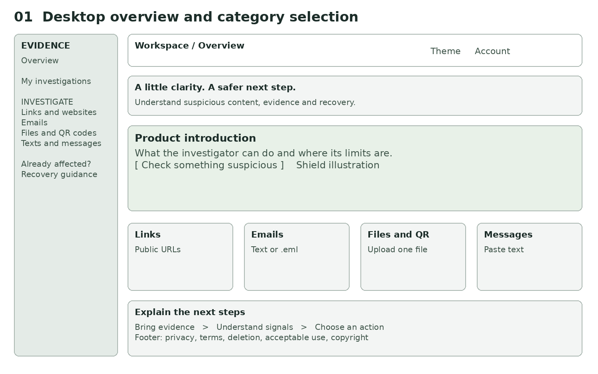
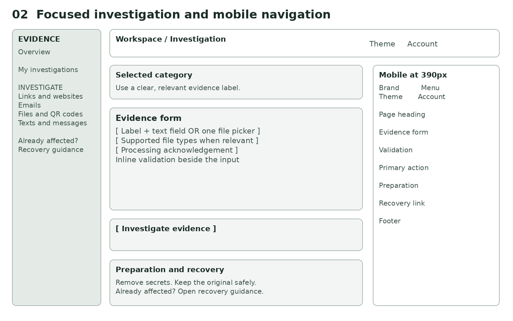
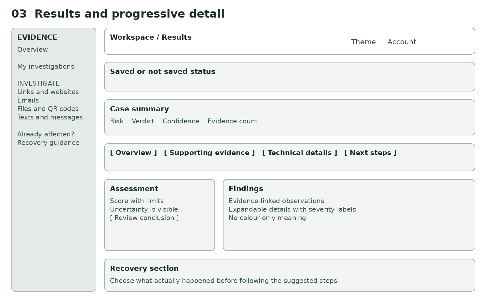
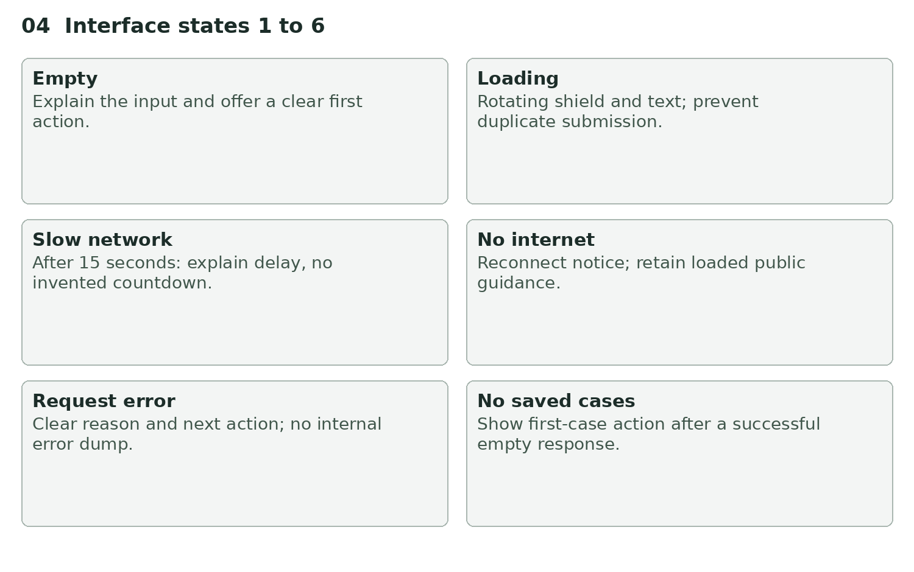
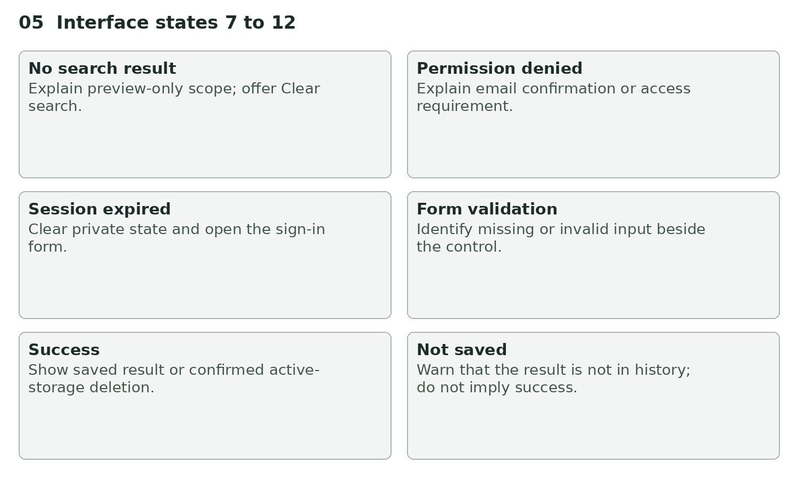

# Wireframes and interface states

These wireframes describe the implemented information architecture. They are design diagrams, not screenshots or evidence of completed browser testing. The overview, investigation and result layouts use the same navigation and utility controls.

## Desktop overview

The left rail provides stable navigation. Public orientation precedes four equally weighted category choices. The top-right controls are theme and account.

## Investigation and mobile layout

The selected category supplies one focused evidence form. Privacy preparation and recovery help follow it on narrow screens. The mobile Menu button exposes the categories and recovery without permanently occupying the first screen.

## Result workspace

Persistence status comes before the assessment. Four labelled section controls separate interpretation, evidence, technical details and response guidance.

## State illustrations

These labelled diagrams specify feedback, not real user data or fabricated evidence of successful checks.

## State behavior

| State | Trigger | User-visible response | Next action |
| --- | --- | --- | --- |
| Empty input | New category form | Relevant label, example and privacy preparation | Enter evidence |
| Loading | Analysis or review pending | Indeterminate shield and disabled submission | Keep page open |
| Slow network | Request exceeds 15 seconds | Explanation of cold starts or provider delay | Wait; avoid duplicate submission |
| No internet | Browser offline event | Reconnect notice and disabled submission | Reconnect; read loaded recovery guidance |
| Error | Request fails | Actionable message without raw provider detail | Resolve cause and retry manually |
| No saved cases | Loaded history empty | Explanation and start-investigation link | Start a check |
| No search result | Loaded case-preview filter has no matches | Scope explanation and Clear search | Change or clear search |
| Permission denied | Unconfirmed or disallowed identity | Confirm-email/account guidance | Correct identity or confirmation |
| Session expired | Missing or rejected session | Sign-in prompt and status message | Sign in again |
| Form validation | Missing content, wrong file, bad URL or missing acknowledgement | Inline alert beside form | Correct input |
| Success | Saved result or deletion completes | Accurate saved/deleted notice | Review findings or return to history |
| Unsaved result | Persistence fails after analysis | Explicit not-saved warning | Check service before leaving |

No-result findings must not imply safety. Technical sections that do not apply explain that no checks are available. The slow-state notice is not a countdown and does not promise a completion time.

## Dialogs and failure transitions

Account dialog opens from the top bar or an authentication requirement; Escape or Close returns focus. Registration, login, reset and password update have distinct labels. Reset and signup avoid exposing whether an address already has an account.

Deletion confirmation names the irreversible active-storage action and initially focuses Keep investigation. A failed deletion leaves an error and does not remove the case from the local list. The UI must never display success only because a button was pressed.

An authentication identity change clears private results and history. Pending browser requests are cancelled, and late results from a previous identity are discarded. Offline detection is a convenience hint; a network request can still fail when navigator.onLine reports true.

## Review checklist

Test all states in the deployed build using synthetic evidence, both themes, keyboard and screen reader, narrow viewports, long content and reduced motion. Check focus location after navigation and dialog dismissal, live-region announcements and 200 percent zoom. Local mocked browser checks pass for representative states, responsive layouts, focus and reduced motion. Deployed account flows, real devices, screen readers and zoom remain manual release checks.
